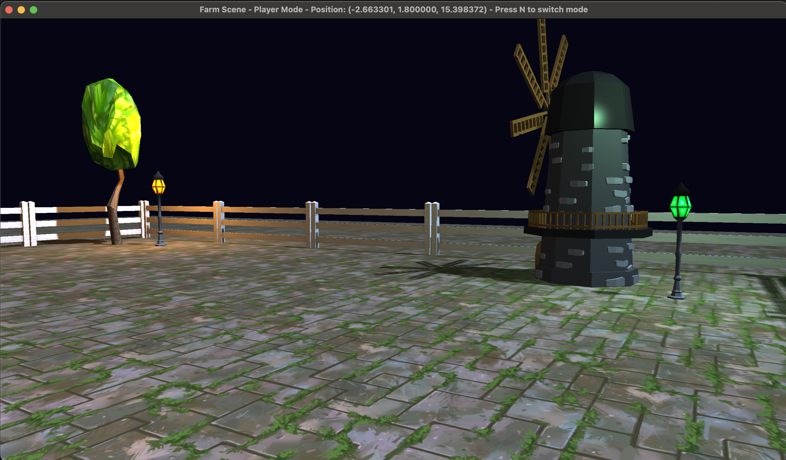
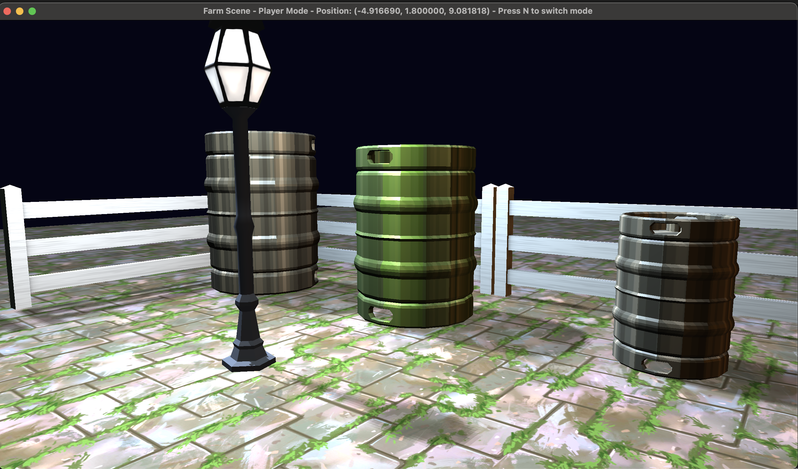
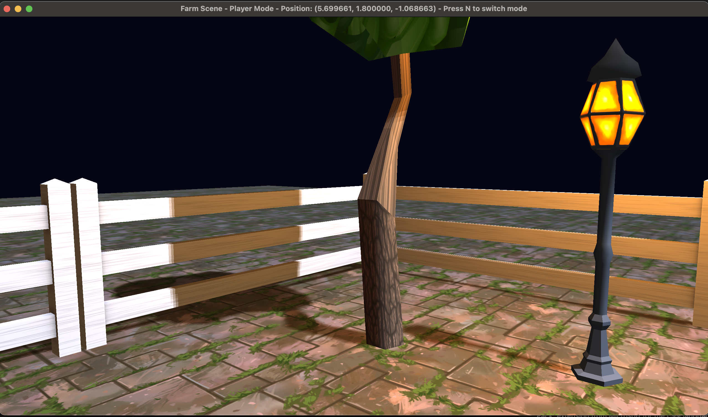
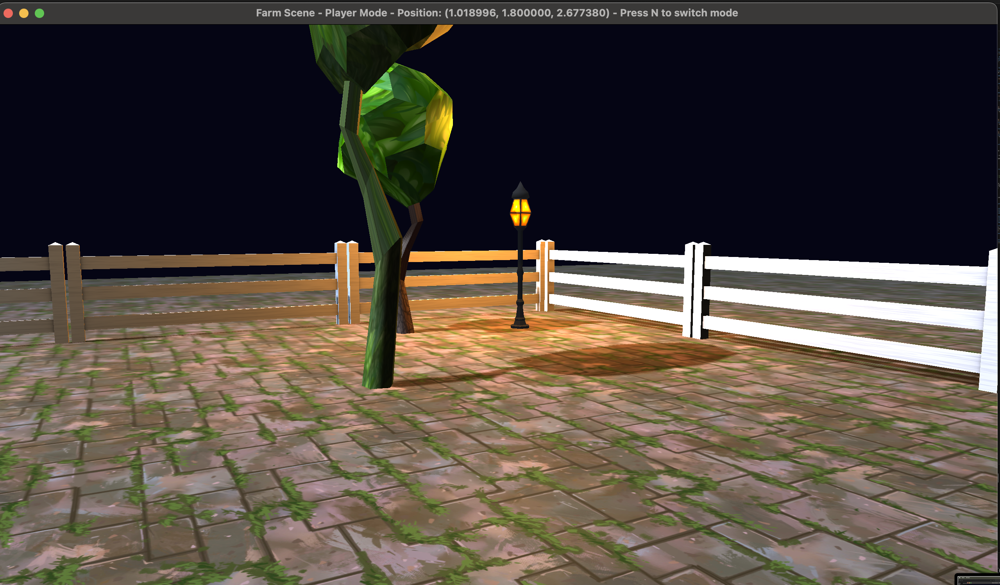

# 3D Farm Scene - OpenGL Graphics Engine

A sophisticated 3D farm scene implementation showcasing advanced computer graphics techniques including Phong lighting, shadow mapping, collision detection, and real-time rendering using modern OpenGL and C++.

## 🎯 Project Overview

This project demonstrates comprehensive 3D graphics programming skills through the implementation of an interactive farm environment. The scene features multiple animated objects, advanced lighting systems, realistic shadows, and physics-based collision detection, all rendered using OpenGL 3.3 Core Profile.

### Key Features
- **Advanced Lighting System**: Multiple point lights with Phong illumination model
- **Shadow Mapping**: Real-time shadow generation for enhanced realism
- **Collision Detection**: AABB-based physics system with sliding collision response
- **Interactive Navigation**: First-person and god-mode camera systems
- **Procedural Animation**: Rotating windmills, trees, and environmental objects

## 🏗️ Technical Architecture

### Graphics Pipeline
- **Modern OpenGL**: 3.3 Core Profile with programmable shaders
- **Shader Programming**: Custom vertex and fragment shaders for lighting and shadows
- **Texture Management**: Multi-texture blending and material systems
- **Model Loading**: Assimp integration for complex 3D model imports

### Rendering Features
- **Phong Lighting Model**: Ambient, diffuse, and specular lighting calculations
- **Shadow Mapping**: Depth buffer-based shadow generation
- **Texture Blending**: Advanced material mixing for realistic surfaces
- **Instanced Rendering**: Efficient rendering of multiple similar objects

### Physics & Interaction
- **AABB Collision Detection**: Axis-aligned bounding box intersection testing
- **Sliding Collision Response**: Smooth wall-sliding mechanics
- **Boundary Enforcement**: Farm perimeter collision constraints
- **Object Avoidance**: Dynamic collision with environmental objects

## 🎮 Scene Components

### Animated Objects
- **Windmill**: Central rotating animation with multiple moving parts
- **Trees (3x)**: Rotating foliage with different scales and blend modes
- **Barrels (3x)**: Various sizes with rotation and texture blending
- **Environmental Elements**: Dynamic lighting and shadow interactions

### Lighting System
- **Point Lights (4x)**: Strategically placed lamps with different colors
- **Dynamic Shadows**: Real-time shadow casting from all light sources
- **Ambient Lighting**: Global illumination for scene coherence
- **Specular Highlights**: Material-based reflection calculations

### Interactive Elements
- **Fence System**: Perimeter boundaries with collision detection
- **Gate Mechanism**: Interactive farm entrance/exit
- **Terrain Navigation**: Smooth movement across farm landscape
- **Object Interaction**: Collision response with all scene elements


## 🎮 Controls & Navigation

### Movement Controls
- **W/A/S/D**: First-person movement (forward/left/backward/right)
- **Mouse**: Camera rotation and look-around
- **N**: Toggle between Player Mode and God Mode
- **ESC**: Exit application

### Camera Modes
- **Player Mode**: Ground-level navigation with collision detection
- **God Mode**: Free-flying camera for scene overview and debugging

## 📊 Technical Implementation

### Core Technologies
- **C++17**: Modern C++ with STL containers and smart pointers
- **OpenGL 3.3**: Core profile with programmable pipeline
- **GLFW**: Cross-platform window management and input handling
- **Assimp**: 3D model loading and processing
- **GLM**: Mathematics library for graphics computations
- **STB Image**: Texture loading and image processing

### Shader Programming
```glsl
// Vertex Shader Features
- Model-View-Projection transformations
- Normal matrix calculations for lighting
- Texture coordinate interpolation
- Shadow map coordinate generation

// Fragment Shader Features  
- Phong lighting implementation
- Multi-texture blending
- Shadow map sampling and filtering
- Material property calculations
```

### Data Structures
```cpp
// Core Classes
class Scene          // Scene graph management
class Camera         // View and projection matrices
class Light          // Point light properties
class Model          // 3D model representation
class Collision      // AABB intersection testing
class Shader         // OpenGL shader program wrapper
```

## 🔧 Advanced Features

### Shadow Mapping Implementation
- **Depth Buffer Generation**: First-pass rendering to shadow maps
- **Perspective Shadow Maps**: Accurate shadow projection from light sources
- **Shadow Filtering**: PCF (Percentage Closer Filtering) for soft shadows
- **Bias Correction**: Shadow acne prevention techniques

### Collision Detection System
- **AABB Construction**: Automatic bounding box generation for all objects
- **Broad Phase Detection**: Spatial partitioning for performance optimization
- **Narrow Phase Testing**: Precise intersection calculations
- **Collision Response**: Sliding mechanics and penetration resolution

### Performance Optimizations
- **Frustum Culling**: Off-screen object elimination
- **Level-of-Detail**: Distance-based model simplification
- **Batch Rendering**: Grouped draw calls for similar objects
- **Efficient State Management**: Minimized OpenGL state changes

## 🎨 Visual Showcase

### Screenshots


*Complete 3D farm environment with multiple objects and lighting*


*Multiple point lights and Phong illumination demonstration*


*Rotating windmill with dynamic shadows and texture blending*


*Player interaction with boundaries and object avoidance*


*Close-up view of texture blending and material properties*


*Real-time shadow casting and filtering effects*

The project includes 6 comprehensive screenshots demonstrating:
1. **Overall Farm Scene**: Wide view showing complete environment
2. **Lighting Demonstration**: Multiple point lights and shadow effects
3. **Animation Systems**: Windmill rotation and object movement
4. **Collision Visualization**: Player interaction with boundaries
5. **Texture Detail**: Close-up material and blending effects
6. **Shadow Quality**: Dynamic shadow casting and filtering

## 🏆 Learning Outcomes

This project demonstrates proficiency in:
- **3D Graphics Programming**: OpenGL, shaders, rendering pipeline
- **Computer Graphics Theory**: Lighting models, shadow algorithms, collision detection
- **C++ Development**: Modern C++, memory management, object-oriented design
- **Mathematical Computing**: Linear algebra, matrix transformations, vector operations
- **Software Architecture**: Modular design, separation of concerns, extensible systems
- **Cross-Platform Development**: Windows, macOS, and Linux compatibility


### Prerequisites

#### macOS (Homebrew)
```bash
brew install glfw assimp glm
```

#### Ubuntu/Debian
```bash
sudo apt update
sudo apt install libglfw3-dev libassimp-dev libglm-dev
```

#### Windows (MSYS2/MinGW)
```bash
pacman -S mingw-w64-x86_64-glfw mingw-w64-x86_64-assimp mingw-w64-x86_64-glm
```

### Building the Project

#### macOS
```bash
g++ src/main.cpp src/glad.o \
    -I/opt/homebrew/include -Iinclude -I./src \
    -L/opt/homebrew/lib -lglfw -lassimp -lz -framework OpenGL \
    -std=c++17 -o Farm
```

#### Linux
```bash
g++ src/main.cpp src/glad.o \
    -Iinclude -I./src \
    -lglfw -lassimp -lGL -ldl \
    -std=c++17 -o Farm
```

#### Windows (MinGW)
```bash
g++ src/main.cpp src/glad.o \
    -Iinclude -I./src \
    -lglfw3 -lassimp -lopengl32 -lgdi32 \
    -std=c++17 -o Farm.exe
```

### Running the Application
```bash
./Farm        # macOS/Linux
Farm.exe      # Windows
```

